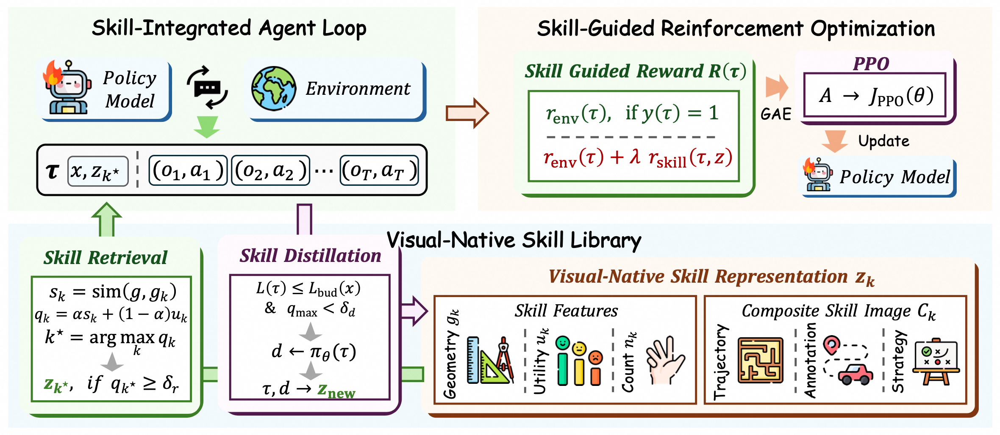
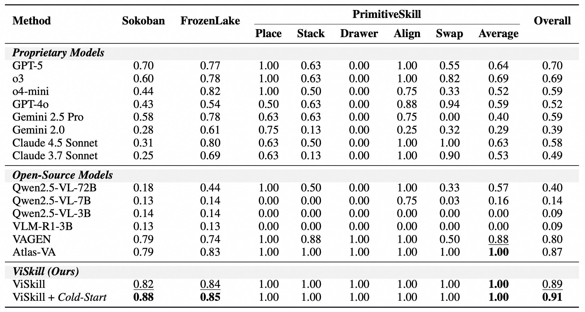
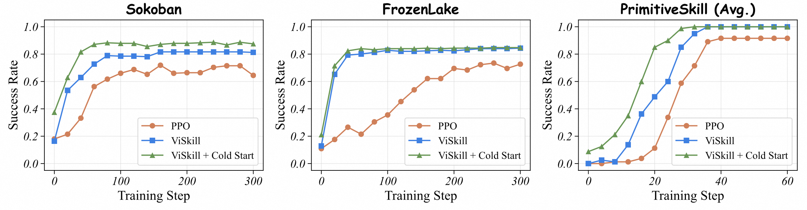

<h1 align="center">
ViSkill: Reinforcing VLM Agents with Evolving Visual-Native Skills
</h1>

<div align="center">
  <p>
    <!-- Replace the empty href values with the paper and checkpoint URLs. -->
    <a href="" target="_blank">
      
    </a>
    <a href="https://huggingface.co/hongxingli/ViSkill-Sokoban" target="_blank">
      
    </a>
    <a href="https://huggingface.co/hongxingli/ViSkill-FrozenLake" target="_blank">
      
    </a>
  </p>
</div>

## 🔥 Overview

We introduce **ViSkill**, a visual-native skill learning framework that turns successful interactions into reusable **visual skill cards**, preserving spatial structure through annotated trajectories and distilled strategies. ViSkill couples skill learning with PPO in a closed feedback loop: geometry-aware retrieval provides visual guidance and skill-guided rewards, while successful trajectories are distilled back into an evolving skill library.

<p align="center">
  
</p>

With Qwen2.5-VL-3B, ViSkill achieves **89% overall success**, rising to **91% with cold-start initialization**, across Sokoban, FrozenLake, and PrimitiveSkill, outperforming all evaluated proprietary and open-source baselines in overall success rate.

<p align="center">
  
</p>

ViSkill converges faster than standard PPO across all three environments, with optional cold-start initialization further accelerating early-stage learning.

<p align="center">
  
</p>

## 🎉 News

- **[2026/10/08]** We release our [code](https://github.com/ZJU-REAL/ViSkill) and models for [Sokoban](https://huggingface.co/hongxingli/ViSkill-Sokoban) and [FrozenLake](https://huggingface.co/hongxingli/ViSkill-FrozenLake).

## 📖 Usage

### Environment Installation

Clone the repository and install the dependencies in a CUDA-enabled Linux environment:

```bash
git clone https://github.com/ZJU-REAL/ViSkill.git
cd ViSkill

conda create -n viskill python=3.10 -y
conda activate viskill

bash install.sh
```

Install the environment-specific rendering dependencies and assets when needed, including ManiSkill for PrimitiveSkill:

```bash
bash install_render.sh
```

### Training

Training scripts use Qwen2.5-VL-3B-Instruct by default. Task configurations and seeds are provided in the YAML files under `examples/train/`.

> **Note:** Before training, adjust `CUDA_VISIBLE_DEVICES` and `REF_MODEL_PATH` in the scripts to match your setup. For PrimitiveSkill, start the environment server first and ensure `base_urls` in the task YAML files matches its address.

**Sokoban**

```bash
# PPO baseline
bash examples/train/sokoban/train_ppo_qwen25vl3b_base.sh

# ViSkill
bash examples/train/sokoban/train_ppo_qwen25vl3b_skill.sh
```

**FrozenLake**

```bash
# PPO baseline
bash examples/train/frozenlake/train_ppo_qwen25vl3b_base.sh

# ViSkill
bash examples/train/frozenlake/train_ppo_qwen25vl3b_skill.sh
```

**PrimitiveSkill**

Start the environment server in a separate terminal:

```bash
bash examples/train/primitive_skill/start_env_server.sh
```

Then launch training:

```bash
# PPO baseline
bash examples/train/primitive_skill/train_ppo_qwen25vl3b_base.sh

# ViSkill
bash examples/train/primitive_skill/train_ppo_qwen25vl3b_skill.sh
```

### Optional Cold-Start Initialization

Cold start is disabled by default. To initialize the skill library with solver-derived seed skills, configure `YOUR_API_BASE_URL` and `YOUR_API_KEY` in the corresponding `cold_start_*.yaml` file, then generate a library:

```bash
# Sokoban
bash examples/train/sokoban/generate_cold_start.sh

# FrozenLake
bash examples/train/frozenlake/generate_cold_start.sh

# PrimitiveSkill (requires the environment server)
python -m vagen.skills.cold_start \
  --config-path="$PWD/examples/train/primitive_skill" \
  --config-name=cold_start_maniskill
```

Set `skill_system.cold_start.enable=true` and point `skill_system.cold_start.source` to the generated library in the corresponding ViSkill training script.

### Evaluation

ViSkill is evaluated through validation rollouts during training. The scripts under `examples/evaluate/` evaluate proprietary and open-source VLM baselines through API or local inference endpoints.

For local inference, start the model service:

```bash
bash examples/evaluate/launch_sglang.sh
```

Set `backends.openai.base_url`, `backends.openai.model`, and the API key in the environment's `config.yaml` to match your endpoint, then run:

```bash
bash examples/evaluate/sokoban/run_eval.sh
bash examples/evaluate/frozenlake/run_eval.sh

# Requires the PrimitiveSkill environment server
bash examples/evaluate/primitive_skill/run_eval.sh
```

For a local checkpoint, set `MODEL_PATH` and `MODEL_NAME` when launching the model service, and use the same model name in the evaluation config.

## 🙏 Acknowledgement

This project builds on [VAGEN](https://github.com/mll-lab-nu/VAGEN) and [veRL](https://github.com/volcengine/verl). We thank the authors for their open-source contributions. The required veRL source is bundled for reproducibility, with original licenses and notices retained.

<!-- Add a BibTeX citation once publication details are available. -->
